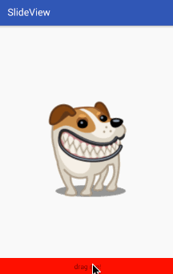

# SlideView

A view can scroll by your finger! Just like android Notification.



### Usage

#### First:include to your project

compile 'com.dy.www:slideview:1.1.0@aar'

#### Second:add DragRelativeLayout in xml

```java
<com.dy.www.library.DragRelativeLayout
        android:id="@+id/drl_content"
        android:layout_width="match_parent"
        android:layout_height="match_parent">
        <ImageView
            android:layout_width="200dp"
            android:layout_height="200dp"
            android:background="@drawable/russel"
            android:layout_centerInParent="true"/>
    </com.dy.www.library.DragRelativeLayout>
```
#### Third:set footerView in java code

```java
	SlideView slideView = new SlideView(context);
        slideView.setBackgroundColor(Color.RED);
        TextView textView = new TextView(context);
        textView.setText("drag me!");
        textView.setGravity(Gravity.CENTER);
        slideView.addView(textView, ViewGroup.LayoutParams.MATCH_PARENT,
                ViewGroup.LayoutParams.MATCH_PARENT);
        dragRelativeLayout.setFooterView(slideView);
```


